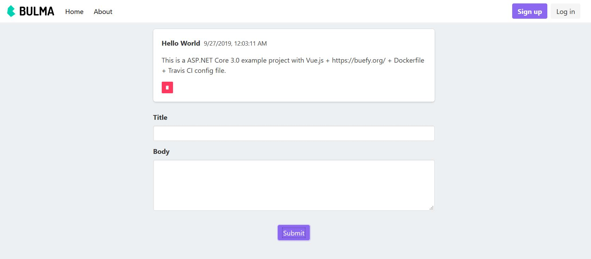

# .Net Core 3.0 VueJs Example Project

[](https://travis-ci.com/matusnovak/aspnet-core-vuejs-example)

This is an example project of .NET Core 3.0 with Vue.js and integration tests. This project was mainly inspired by the [Integration tests in ASP.NET Core - Microsoft docs](https://docs.microsoft.com/en-us/aspnet/core/test/integration-tests?view=aspnetcore-3.0).

**Why another example project?** There are plenty similar example projects for Vue.js and .NET Core. But, they usually either have only Vue.js or integration tests, never both. I could not find a working example for .NET Core 3.0 that has proper setup for Vue.js **and** integration tests as well. So, I have made one. Moreover, I did not find the idea of putting together both the API and Vue.js files into a single folder, it makes things messy. So I have decided to split it into two separate C# projects, and I think you will like it.



*The screenshot has a [Sign up] and [Log in] button, but they are purely decorative. Authentication has not been set up in this project.*

## Features

* A simple "Todo" app
* NET Core 3.0
* NET Core integration tests
* Async/await
* Vue.js 2 + router + [Buefy](https://buefy.org/) (which can be easily removed, only here as an example)
* Backend API and frontend Vue is properly split in two C# projects
* Comes with Dockerfile
* Travis CI ready
* In memory database already preconfigured
* **Pre-made repository and entity interfaces** - Go and see `src/Example.Api/Data` folder.

## Does not have

* Authentication
* MVC
* Razor views
* Webpack shenanigans

## Project structure

This example comes with the three C# projects:

* **src/Example** - This is the hearth of the application, contains Vue.js files, but not the REST api related things.
* **src/Example.Api** - Used by the main project, contains Data, Models, Controllers, etc.
* **tests/Example.IntegrationTests** - As the name says, the integration tests.

Detailed folder structure:

* **src/**
    * **Example/**                            - *The project that run the server*
        * **Client/**                         - *Vue.js project files*
        * **Program.cs**                      - *You know what this is!*
        * **Startup.cs**                      - *You also know what this is!*
    * **Example.Api/**                        - *The API part of this project separated from the Vue.js side*
        * **Controllers/**
            * **TodoController.cs**           - *Controller for "Todo.cs"
        * **Data/**                           - *All of the database related * stuff*
            * **ApplicationDbContext.cs**     - *All apps need DbContext*
            * **IEntity.cs**                  - *Base class for all models*
            * **IRepository.cs**              - *A base repository interface*
            * **Repository.cs**               - *A base repository class with common methods such as FindAll, FindBy, Create, etc.*
            * **TodoRepository.cs**           - *Repository for "Todo.cs"*
        * **Models/**                         - *Location of all models*
            * **Todo.cs**                     - *Sample model drived from * IEntity*

        * **Example.Api.csproj**              - *Project descriptor*
* **test/**
    * **Example.IntegrationTests/**           - *A project dedicated for integration tests*
        * **Controllers/** 
            * **TodoControllerTests.cs**      - *A sample test*

        * **ApplicationTestFactory.cs**       - *Tests configuration*
        * **Example.IntegrationTests.csproj** - *Project descriptor*

## Building 

This will automatically run `npm install` and `npm build` for the frontend.

```
dotnet publish "Example.csproj" -c Release -o /some/path
```

## Development

First, you will need to install NPM dependencies. To do that, go to the `Example` project folder, then install.

```
cd src/Example
npm install
```

To run build the frontend, run `npm run build`. But for development purposes, it is much better to run it in a watch mode. It will continue building until you press `Ctrl+C` and will update the frontend dist files (if any .Vue or .js file has changed) very quickly.

```
cd src/Example
npm run watch
```

To run the backend, open it through an IDE or just run:

```
cd src/Example
dotnet run
```

## Contribution

Feel free to submit a pull request

## Contact
	skype: live:.cid.5d1a82b4c01907a4
	discord: fourmagic#5051
   telegram: @fourmagic

